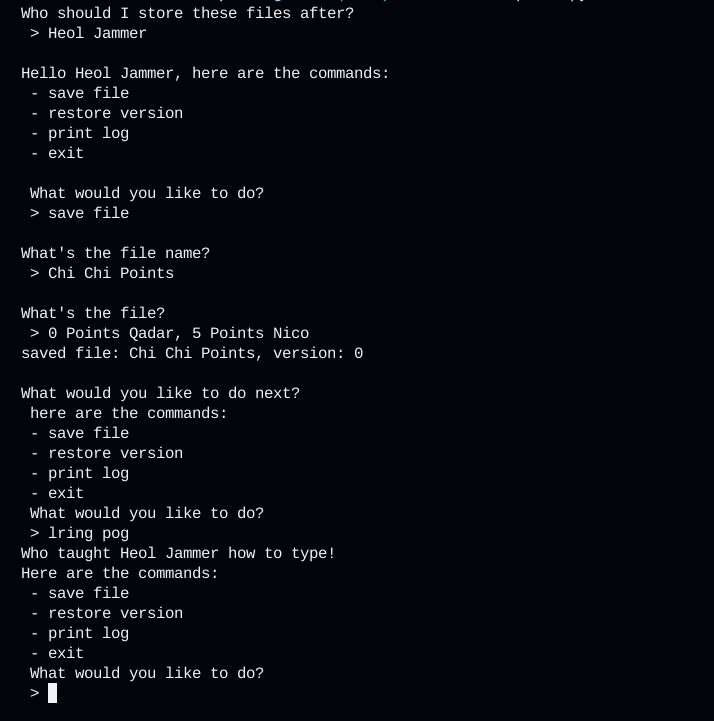

---
# VersionControl.py - User Guide

**`VersionControl.py` is a program designed to help the user easily keep track of the changes across multiple files!**



1. **Setup**: Ensure you have Python installed on your system. Clone the repository containing `VersionControl.py` to your local machine.

2. **Features**:
    - **Save Files**: Use the program to save personal files by their identifying name and insert the file right into the sistem from the terminal!
    - **Save Versions**: With this program, you not only have the ability to save files, but also to track the version history of these files as each version and it's changes are saved in the system when you save a file twice!
    - **Restore a File**: Since the version history of a file is saved, you can go back to and restore any previous version of a file you saved to the system!
    - **View a log**: Review the history of changes and commits accross all files, at the same time!.

3. **Running the Program**: Open a terminal, navigate to the directory containing `VersionControl.py`, and execute the script using:
    ```bash
    python VersionControl.py
    ```

4. **Using the program**: The program is designed in regards to having the best user experience, and easy user interaction! Being said, through the terminal, the program will guide you through each step of the process and always remind you of the possible commands!

5. **Exiting**: At any time when you want to quit or exit the program all you have to do is type the word "exit"!

 
## CheetSheet

- **"save file"**: Guides the user through the process of saving previous or new file/version!
- **"restore version:"** Guides the user through the process of restoring a saved file version!
- **"print log:"** Dysplays a "map" of all the files, their versions, and each version's corresponding changes!
- **"exit"** Exits the program!

###### Refer to the inline documentation in `VersionControl.py` for more details on specific commands mechanics.